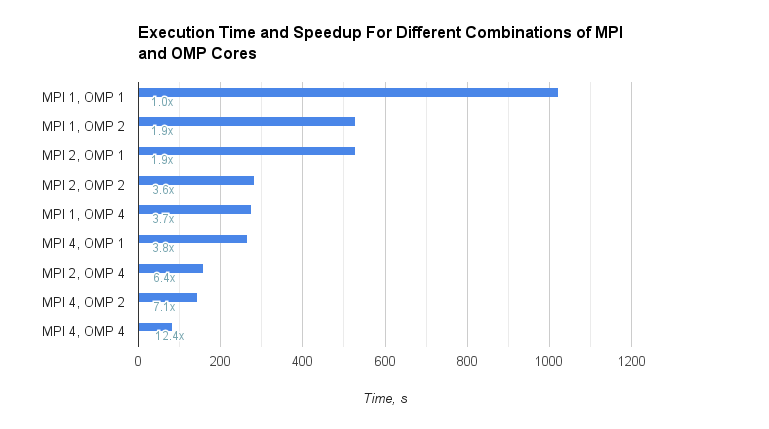

# heat-conduction-solver
Parallel using MPI and OpenMP

### Compiling and Running
##### Step 1. Compile rbbreakup.c utility that splits the input file into files with subgrids:

``cc -Wall rbbreakup.c -o rbb -O``

##### Step 2. Run rbb on an input file with desired number of i- and j- chunks:

``./rbb -ichunk 2 -jchunk 2 -in input.txt``

This will generate four files, _input.txt.0_, _input.txt.1_, _input.txt.2_ and _input.txt.3_, that will be processed by four MPI ranks.

Here, `-ichunk` specifies in how many "columns" we split the grid, `-jchunk` – in how many "rows". When `ichunk = 1` and `jchunk = 2`, the grid stays the same.

When `ichunk = 1` and `jchunk = 2`, the division will look like this:

| subgrid 0 |
| --- |
| **subgrid 1** |

When `ichunk = 2` and `jchunk = 2`, the division will look like this:

| subgrid 0 | subgrid 1 |
| --- | --- |
| **subgrid 2** | **subgrid 3** |

##### Step 3. Compile stencil.c:

``mpicc -fopenmp -o s stencil.c``

##### Step 4. Run:

``mpirun --bind-to none -n 4 ./s -inp input.txt -res output.txt -n 4 -ichunk 2 -jchunk 2``

Here, `-n` specifies the number of cores used by MPI, which should be equal to the number of subgrids (= files), and `ichunk * jchunk = n`. `-threads` is the number of threads used by OMP. `ichunk` and `jchunk` is the number of blocks. Best performance is achieved when `threads = n`.

### Performance

